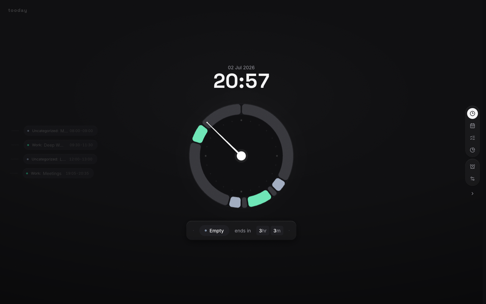
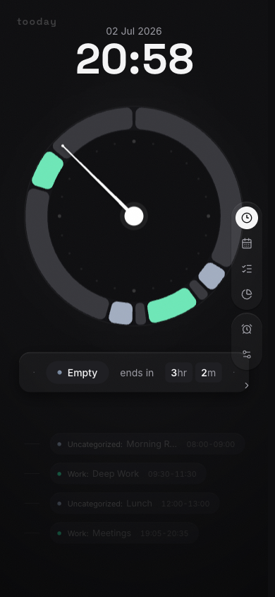

# tooday

Local-first day planning wrapped around a clock. Based on
[Cloock](https://github.com/aykutkardas/cloock) by
[@aykutkardas](https://github.com/aykutkardas) — see
[Origins & Credits](#origins--credits).

tooday is a self-hostable personal planner for people who want a fast, private
surface for planning the day, tracking focus, and reviewing time without a
subscription. The current app stores data locally in the browser. The roadmap is
to keep the default experience local, add optional self-host storage, and expose
AI through BYOK provider keys instead of a hosted paid account.



## What Works Today

- Clock-first day view with a 24-hour radial timeline.
- Plan view with day/week switching, drag-style timeline affordances, templates,
  categories, copy-day actions, and cut mode.
- Todo list with optional activity tagging.
- Report view for planned time summaries and Pomodoro rounds.
- Command palette for navigation, quick actions, and natural-language quick add.
- Pomodoro bar, browser notifications, PWA registration, and theme settings.
- Local browser persistence through Zustand storage.



## Local Setup

```bash
git clone git@github.com:bulbulogludemir/tooday.git
cd tooday
npm ci
npm run dev
```

Open `http://localhost:3000`.

Production-style local run:

```bash
npm run build
npm run start
```

## Self-Host Shape

Today, the app can be built and run on any Node-capable machine:

```bash
git pull
npm ci
npm run build
npm run start -- --port 3210
```

Put nginx, Caddy, or another reverse proxy in front of `next start` when running
it on a server. See [docs/self-hosting.md](docs/self-hosting.md).

Important current boundary: storage is browser-local right now. If you open the
same server from another browser or device, it will not see the same plan until
the planned local/self-host sync layer is added.

## BYOK AI Roadmap

AI is intentionally not required for the planner. The intended shape is:

- No subscription gate.
- User-owned provider keys stored locally or on the self-hosted instance.
- Provider adapters for OpenAI-compatible APIs first.
- Optional local Codex account integration later, with explicit account and
  privacy boundaries.

See [docs/local-ai-byok.md](docs/local-ai-byok.md).

## Project Knowledge Base

The repo includes an LLMiki wiki under [wiki/](wiki/). Start at
[wiki/index.md](wiki/index.md) for product direction, architecture notes, open
questions, and source summaries.

## Scripts

```bash
npm run dev      # start local dev server
npm run build    # production build
npm run start    # serve the production build
npm run lint     # ESLint
npm run test     # Vitest unit tests
```

## Origins & Credits

tooday started as a derivative of [Cloock](https://github.com/aykutkardas/cloock)
by [Aykut Kardaş](https://github.com/aykutkardas) ([cloock.co](https://cloock.co)).
The clock-first day view concept and the original codebase this project grew
from are his work.

This repo is not a GitHub fork because it predates Cloock's open-source
release: it began as a private clone of the codebase, shared directly by the
author before the public repository existed, so there was no upstream to fork
from. Development has diverged independently since then (plan/todo/report
views, command palette, Pomodoro, AI features, and more).

This use — including commercial use — is with the original author's
permission. Cloock is now open source under the MIT license as well. If you
like the core idea, go star the original.

## License

MIT. See [LICENSE](LICENSE).
