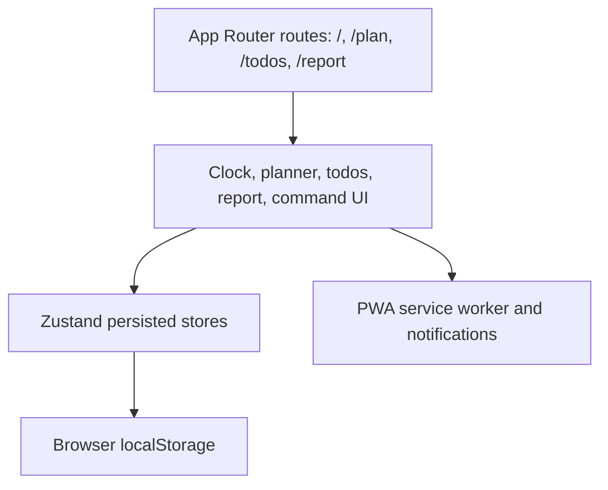

# Architecture

tooday is currently a client-heavy Next.js App Router application.

## Runtime Layers

## Important Files

- `src/app/page.tsx`: clock-first day view.
- `src/app/plan/page.tsx`: day/week planning surface.
- `src/app/todos/page.tsx`: todo list and activity tagging.
- `src/app/report/page.tsx`: time summary cards.
- `src/stores/usePlanStore.ts`: plans, categories, todos, templates.
- `src/stores/usePomodoroStore.ts`: focus rounds.
- `src/components/CommandPalette.tsx`: navigation and quick-add actions.

## Current Data Model

The main persisted entities are:

- categories;
- activities keyed by `YYYY-MM-DD`;
- todos;
- day templates;
- settings;
- Pomodoro progress.

The current store is intentionally local and browser-scoped. Server-side data
should be added only behind an explicit self-host/sync mode.
