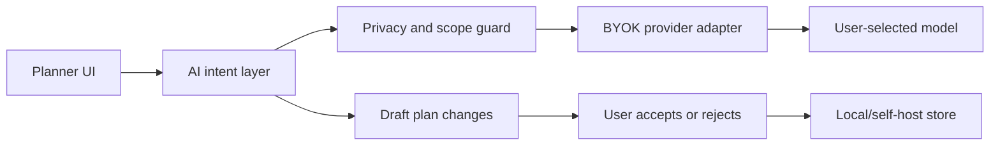

# Local AI And BYOK Roadmap

AI should be optional in tooday. The planner must stay useful with no model, no
account, and no subscription.

## Goals

- BYOK: users provide their own provider key.
- Local-first: keys and prompts stay on the local machine or self-hosted server.
- Provider-neutral: start with OpenAI-compatible APIs, then add adapters.
- Transparent: every AI action should show what data it used.
- Reversible: generated plans should be drafts until accepted.

## Candidate Features

- "Plan my day" from rough tasks and time constraints.
- Natural-language schedule editing.
- Conflict explanations and alternative free slots.
- Weekly summary and habit insights.
- Local Codex account connection as an optional advanced integration.

## Suggested Architecture

## Not Implemented Yet

- Provider key storage.
- Model picker.
- Server-side AI route.
- Codex account connection.
- Syncing plans across devices.

Keep these as roadmap items until the privacy and self-hosting boundaries are
explicit.
